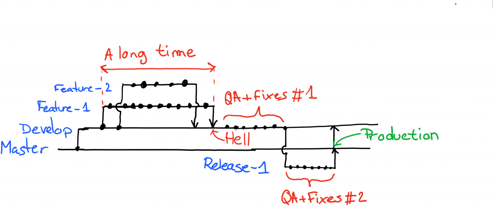
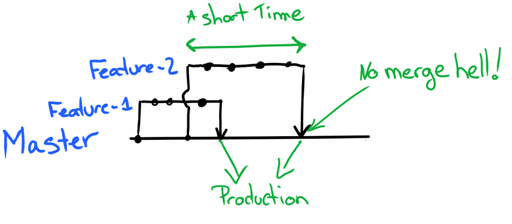

#HSLIDE

An Introduction to <span style="color:#e49436">GitHub Flow</span>


#HSLIDE

Before we start...

There is an introduction to <span style="color:#e49436">git</span> here if you need it...

https://www.gitpitch.com/frozenskys/githubflow-docs/introduction-to-git

#HSLIDE

Github Flow

<span style="color:gray;font-style: italic;font-size:0.6em;"><span style="color:#e49436">"</span>GitHub Flow is all about short feedback loops (everything in DevOps mostly is, actually). This means work branches 
(‘work’ could mean a new feature or a bug fix – there is no distinction) starts from the production code (master) and are short 
lived – the shorter the better. Merging back becomes a breeze and we are truly continuously integrating.<span style="color:#e49436">"</span></span>

#VSLIDE
The old way



#VSLIDE

The <span style="color:#e49436">new</span> way



#VSLIDE 

- Anything in the master branch is deployable <!-- .element: class="fragment" -->
- To work on something new, create a descriptively named branch off of master <!-- .element: class="fragment" -->
- Commit to that branch and regularly push your work to the server <!-- .element: class="fragment" -->
- When you need feedback or help, or you think the branch is ready for merging, open a pull request <!-- .element: class="fragment" -->
- After someone else has reviewed and signed off on the feature, you can merge it into master <!-- .element: class="fragment" -->
- Once it is merged and pushed to ‘master’, you can and should <span style="color:#e49436">deploy immediately</span> <!-- .element: class="fragment" -->

#HSLIDE

Branching

- Branches should be short lived
- Never develop on master! 

#VSLIDE


#VSLIDE

Create a new branch from the current and check it out 

```bash
git checkout -b well-named-feature
```

#VSLIDE

Write some Code...

```javascript
var express = require('express');
var app = express();

app.get('/', function (req, res) {
  res.send('Hello World!');
});

app.listen(3000, function () {
  console.log('Example app listening on port 3000!');
});
```

#VSLIDE

Commit your changes and push to remote

```bash
git add . && git commit -m"Shiny new code" && git push
```

#HSLIDE

The End :)